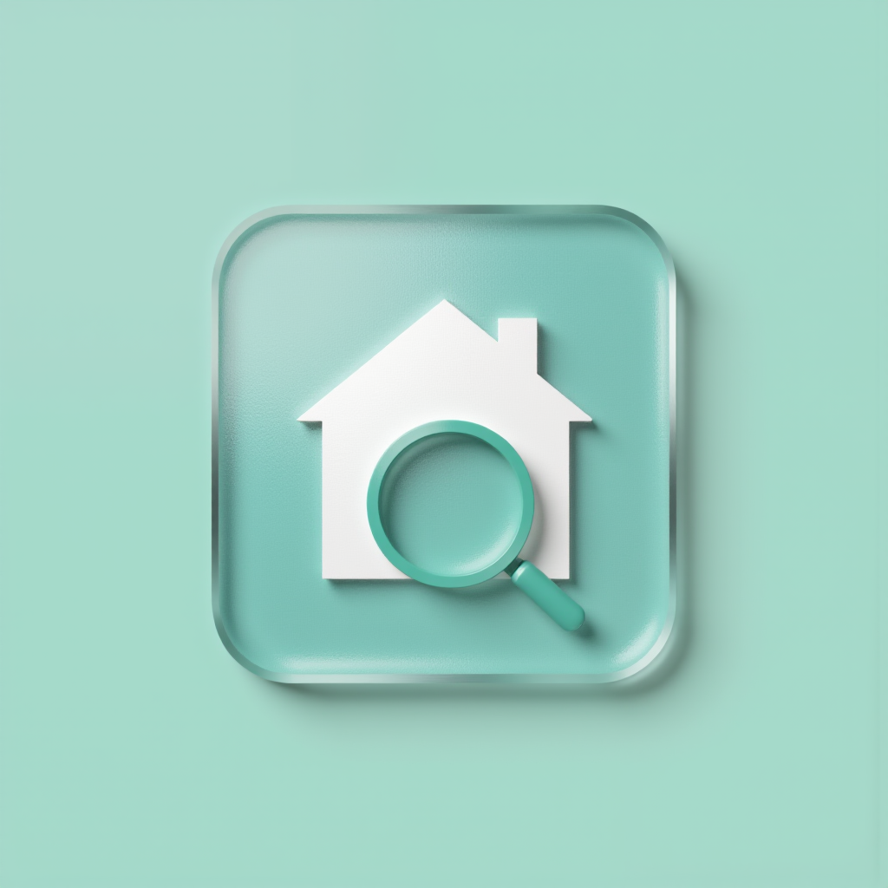

  

<h1 align="center">Whereable</h1>

<h2>[Android Version](https://whereable.techbrain.online/)</h2>
<h2>IOS version on App store</h2>

  <strong>Know where everything is. Instantly.</strong>

  <a href="#features">Features</a> •
  <a href="#why-whereable">Why Whereable</a> •
  <a href="#pricing">Pricing</a> •
  <a href="#privacy">Privacy</a> •
  <a href="#download">Download</a>

  <a href="https://github.com/guoxiujiang1971/whereable/blob/main/PrivacyPolicy.md">Privacy Policy</a>

---

Whereable is a **family-shared item database** built around one question: *"Where is my stuff?"*

Not a cluttered inventory manager. Not a glorified shopping list. A **location retrieval tool** for everything you own — keys, documents, kitchen gadgets, seasonal gear, moving boxes. Search first, find fast.

---

## Features

### 🔍 Search-First Home
Open the app and find what you need in seconds. Results show exactly **where** the item is, along with a photo and when it was last used.

### 👨‍👩‍👧‍👦 Family Sharing (Supabase)
Different Apple IDs, one shared database. Invite your family via iMessage — everyone sees the same items in real time. Set **per-item permissions**: read-only for some, read-write for others, invisible for those who don't need to know.

### 📦 Moving Mode with QR Codes
Everything you own, into labeled boxes, each with a peel-and-stick QR code. Scan to unpack, scan to find. The only app designed around the **moving use case** — and it works even if you don't unpack for months.

- Generate QR codes (`wuyi://box/{uuid}`) for every box
- Print via AirPrint (A4 labels or thermal printers)
- Unpack gradually: take 3 items out today, finish the rest next week
- Or store boxes "as-is" — items inside are still searchable

### 📸 Quick Logging
Three ways to add items:

| Method | Time | Best for |
|--------|------|----------|
| **Photo + AI** | ~3s | Items on a table — VisionKit reads text automatically |
| **Barcode scan** | ~2s | Packaged goods — scans EAN-13, UPC-A, Code 128 |
| **Text bulk entry** | ~2s/item | "Wine glasses×4, stock pot, soy sauce" — hit enter |

### ⏰ Smart Reminders
- Expiry dates for food and skincare
- Warranty tracking with countdown
- Idle item detection — know what you haven't touched in months

### 🔒 Private by Design
- All data stored locally via Core Data
- Syncs through your own iCloud account (encrypted in transit & at rest)
- **Zero** third-party SDKs, analytics, or telemetry
- Camera and photo library access only when you explicitly choose

### 📋 Export & Share
- CSV export for spreadsheets
- PDF insurance inventory with photos
- Generate "for sale" listings from idle items

### More
- **Siri**: "Hey Siri, find my keys"
- **Spotlight**: Search items from iOS system search
- **Widget**: Expiring & recently accessed items on your home screen
- **Dark mode** support

---

## Why Whereable?

| | Sortly | Home Contents | **Whereable** |
|---|---|---|---|
| Search-first design | ❌ | ❌ | **✅** |
| Moving QR workflow | ❌ | ❌ | **✅** |
| iCloud family sharing | ❌ own accounts | ❌ | **✅ zero setup** |
| Per-item permissions | ❌ | ❌ | **✅** |
| Location history | ❌ | ❌ | **✅** |
| Photo + barcode + bulk entry | ✅ partial | ❌ | **✅ all three** |
| Privacy (no third-party SDKs) | ❌ | ❌ | **✅** |

---

## Pricing

| Plan | Price | Best for |
|------|-------|----------|
| **Free** | $0 | Up to 200 items, QR codes, family sync, all entry methods |
| **Pro** | $3.99/mo or $11.99/yr | Unlimited items, smart reminders, Spotlight, Siri, Widget, NFC |
| **Family** | $19.99/yr | Everything in Pro + up to 10 members, audit log, PDF insurance |

> Core features (search, logging, moving QR codes) are **always free**. No artificial limits on the moving workflow — that's the hook.

---

## Privacy

We don't collect anything. No analytics, no crash reports, no tracking, no third-party SDKs. Your data lives on your device and your iCloud account — we can't see it.

[Privacy Policy](https://github.com/guoxiujiang1971/whereable/blob/main/PrivacyPolicy.md)

---

## Built With

- **SwiftUI** — iOS 17+ native UI
- **Core Data + NSPersistentCloudKitContainer** — local-first, iCloud sync
- **CoreImage** — QR code generation
- **AVFoundation** — QR & barcode scanning
- **VisionKit** — Live Text recognition
- **StoreKit 2** — in-app purchases
- **Zero third-party dependencies**

---

  Whereable — Find what matters.

